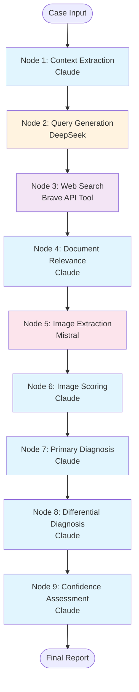

# Detailed Radiology AI Graph Architecture

## Overview
This document describes the detailed LangGraph implementation with all 8 LLM calls as separate nodes for complete tracking and analysis.

## Graph Structure: 9 Nodes (8 LLM + 1 Tool)



## Node Details

### Node 1: Radiology Context Extraction (Claude)
- **Purpose**: Extract structured radiology information
- **Input**: Patient data, clinical history, image description
- **Output**: Anatomical structures, imaging characteristics, measurements
- **Metrics**: Time, tokens, success status
- **Prompt Template ID**: `radiology_context_extraction`

### Node 2: Literature Search Query Generation (DeepSeek)
- **Purpose**: Generate optimized search queries
- **Input**: Radiology context from Node 1
- **Output**: 5 targeted search queries
- **Metrics**: Time, tokens, number of queries
- **Prompt Template ID**: `literature_search_query_generation`

### Node 3: Web Search Execution (Brave API)
- **Purpose**: Execute web searches
- **Input**: Search queries from Node 2
- **Output**: Raw search results
- **Metrics**: Time, results found, API calls
- **Note**: This is a TOOL, not an LLM call

### Node 4: Document Relevance Analysis (Claude)
- **Purpose**: Score document relevance
- **Input**: Search results from Node 3
- **Output**: Relevance scores and reasoning
- **Metrics**: Time, tokens, documents analyzed
- **Prompt Template ID**: `document_relevance_analysis`

### Node 5: Image Description Extraction (Mistral)
- **Purpose**: Extract image descriptions from documents
- **Input**: Relevant documents from Node 4
- **Output**: Image captions and descriptions
- **Metrics**: Time, tokens, images extracted
- **Prompt Template ID**: `image_description_extraction`

### Node 6: Image Relevance Scoring (Claude)
- **Purpose**: Score image relevance to case
- **Input**: Extracted images from Node 5
- **Output**: Image relevance scores
- **Metrics**: Time, tokens, images scored
- **Prompt Template ID**: `image_relevance_scoring`

### Node 7: Primary Diagnosis Generation (Claude)
- **Purpose**: Generate primary diagnosis
- **Input**: All previous analysis results
- **Output**: Diagnosis with confidence and reasoning
- **Metrics**: Time, tokens, confidence score
- **Prompt Template ID**: `primary_diagnosis_generation`

### Node 8: Differential Diagnosis Generation (Claude)
- **Purpose**: Generate alternative diagnoses
- **Input**: Primary diagnosis and case data
- **Output**: List of differential diagnoses
- **Metrics**: Time, tokens, differentials count
- **Prompt Template ID**: `differential_diagnosis_generation`

### Node 9: Confidence Assessment (Claude)
- **Purpose**: Assess overall diagnostic confidence
- **Input**: All diagnoses and evidence
- **Output**: Confidence metrics and recommendations
- **Metrics**: Time, tokens, final confidence
- **Prompt Template ID**: `confidence_assessment`

## Metrics Tracked Per Node

Each LLM node tracks:
- **Model Used**: Which AI model processed this node
- **Processing Time**: How long the node took
- **Token Usage**: Approximate tokens consumed
- **Success/Failure**: Whether the node completed successfully
- **Custom Metrics**: Node-specific metrics (e.g., confidence scores)

## Total Processing Metrics

The graph provides comprehensive metrics:
```json
{
  "total_nodes": 9,
  "total_llm_calls": 8,
  "total_time": 85.3,
  "total_tokens": 12450,
  "models_breakdown": {
    "claude-3-opus": 6,
    "deepseek-chat": 1,
    "mistral-large": 1
  },
  "cost_estimate": {
    "claude": "$2.45",
    "deepseek": "$0.12",
    "mistral": "$0.38",
    "total": "$2.95"
  }
}
```

## Benefits of Detailed Graph

1. **Complete Observability**: Track each LLM call separately
2. **Performance Analysis**: Identify bottlenecks in specific nodes
3. **Cost Tracking**: Monitor token usage per model
4. **Error Isolation**: Pinpoint exactly where failures occur
5. **A/B Testing**: Easy to swap models for specific nodes
6. **Prompt Optimization**: Tune each prompt independently

## Usage Example

```python
from radiology_graph_detailed import detailed_graph

# Run analysis
result = await detailed_graph.ainvoke({
    "case_id": "case-001",
    "patient_age": 45,
    "patient_sex": "Male",
    "clinical_history": "Persistent headaches",
    "imaging_modality": "MRI",
    "anatomical_region": "Brain",
    "image_description": "T2 hyperintensity in temporal lobe"
})

# Access detailed metrics
print(f"Total LLM calls: {result['processing_metadata']['total_llm_calls']}")
print(f"Total time: {result['processing_metadata']['total_time']}s")

# Check individual node performance
for node, metrics in result['processing_metadata']['node_details'].items():
    print(f"{node}: {metrics['time']}s, {metrics['tokens']} tokens")
```

## Deployment Considerations

- **Timeout**: Set to 180s to accommodate all 8 LLM calls
- **Concurrency**: Some nodes could run in parallel (future optimization)
- **Caching**: Consider caching frequently accessed literature
- **Rate Limits**: Monitor API rate limits for each service

## Future Optimizations

1. **Parallel Processing**: Nodes 4-6 could run in parallel
2. **Conditional Branching**: Skip nodes based on confidence
3. **Caching Layer**: Cache literature search results
4. **Model Selection**: Dynamic model selection based on case complexity